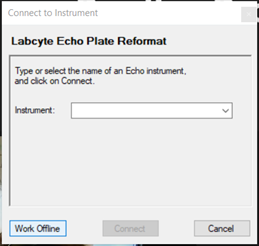
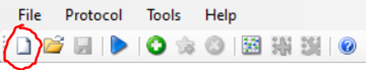
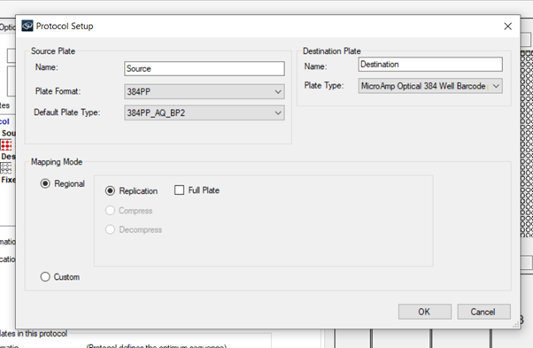
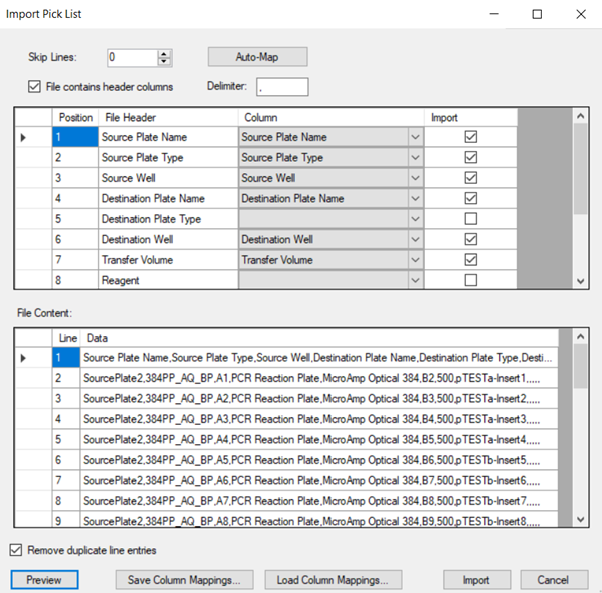
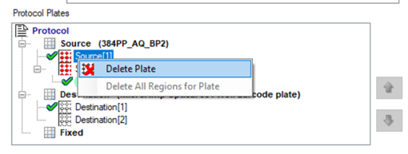
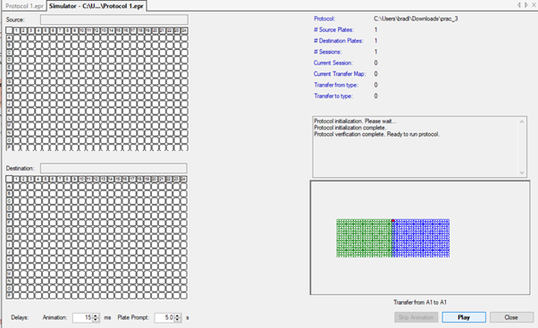

---
[Home](index.md) |
[Getting Started](Getting-Started.md) |
[Generic Tools](BiomationScripter.md) |
[EchoProto](EchoProto.md) |
[EchoProto Templates](EchoProto_Templates.md) |
[OTProto](OTProto.md) |
[OTProto Templates](OTProto_Templates.md)
---

# BiomationScripter - EchoProto
---

[Overview](#feature-overview) | [Importing Picklists](#importing-picklists-via-plate-reformat) | [Using EchoProto](#using-echoproto) | [EchoProto Templates](#echoproto-templates)

---

## Feature Overview

EchoProto is a module within the BiomationScripter package which contains tools specifically aimed at writing protocols for the Echo525. EchoProto enables users to write python scripts which can then generate a set of CSV picklists. The picklists contain a list of transfer actions for the Echo to perform. There is one picklist generated per source plate, and all of the picklists together form the entire protocol. Instructions for importing the picklists to the Echo can be found [here](#importing-picklists-via-plate-reformat).

EchoProto contains two submodules:

* **EchoProto:** A set of functions and classes which are used to capture information about an Echo protocol, and convert this information into a set of picklists
* **EchoProto.Templates:** A set of classes which generate picklists for common protocols, such as Loop assembly and Q5 PCR, based on user inputs

If you are planning on using the Echo to automate common protocols, such as PCR, there may be a pre-written EchoProto template available. A list of currently available templates can be found [here](EchoProto_Templates.md).

If you are planning on automating a protocol which you will use many times, but with slightly different variations/inputs, it may be helpful to create your own EchoProto template. A walkthrough explaining how this can be done can be found [here](example_code/EchoProto/EchoProto-EchoProto_Template-Superclass.ipynb).

If you are planning to automate a protocol for which there are no existing templates, and that protocol will only be repeated identically (or not at all), it may be best to not write a template. In this case, the general BiomationScripter tools and EchoProto tools can be used to help write the protocol.

---

## Importing picklists via Plate Reformat

Plate Refomrat is the proprietary of choice for importing custom picklists into the Echo 525 liquid handling robot. To get started simply launch the software "Labcyte Echo Plate Reformat". Please not that custom picklists should be correctly formatted and saved as a .csv file before continuing this process.

A dialog box should appear to Connect to an Instrument. The instrument can be connected to via its IP address or there is an option to Work Offline.

Working offline may be useful for testing out protocols for simple errors without the need of inserting plates into the machine. After the connection is established, the software GUI should open.

Set-up a new protocol by clicking the new protocol button, this will open the Protocol Setup wizard.

Select the source plate type, the destination plate type and set the mapping type to custom. Click Ok to confirm and generate a new protocol file.

Now, the custom picklist can be imported to the new protocol. This is done using the "Import region definitions" option from the file menu. Import the custom picklist using the wizard. The import wizard will assist in retrieving the correct attributes using the file headers. Ensure that the following have been selected for import and that they map to the correct columns in the csv file:

* Source Plate Name
* Source Plate Type
* Source Well
* Destination Plate Name
* Destination Well
* Transfer Volume

The wizard will show a preview of the custom picklist file being imported, this is useful for proof checking the file before importing. There is a check box to remove duplicate line entries - it is recommended to uncheck this. There is also an option to Preview the import before finalising this. Select Import to import the picklist.

Now that the file has been imported, there should be two of each source and destination plate. The first of each will be the original blank plate from creating the protocol - this should be deleted. The second will contain the transfer steps from the picklist.

The protocol can be simulated and ran from the same software. This is done using the run button, represented by a blue play button.

---

## Using EchoProto
Begin by importing the EchoProto module:

`import BiomationScripter.EchoProto as EchoProto`

The EchoProto module has the following architecture:

The [BiomationScripter.EchoProto.Protocol](#class-protocol) object is populated with [BiomationScripter.EchoProto.TransferList](#class-transferlist)s and [BiomationScripter.EchoProto.Action](#class-action)s through the use of the [BiomationScripter.EchoProto.Generate_Actions](#function-generate_actions) function. A populated [Protocol](#class-protocol) is used to generate CSV picklists by calling the [BiomationScripter.EchoProto.write_picklists](#function-write_picklists) function.

---

## Classes
### Class: [`Protocol`](https://github.com/intbio-ncl/BiomationScripterLib/blob/main/BiomationScripter/EchoProto/__init__.py)
This class is used to store information about a protocol, and can be used to generate CSV picklist files.

**Usage:**

`BMS.EchoProto.Protocol(Title: str)` returns [`BiomationScripter.EchoProto.Protocol`](#class-protocol)

**Attributes:**

* `title` | `str`: A title for the protocol
* `source_plates` | `list[BiomationScripter.Labware_Layout]`: A list of [`BiomationScripter.Labware_Layout`](https://github.com/intbio-ncl/BiomationScripter/wiki/BiomationScripter#class-Labware_Layout) objects which represent the source plates
* `destination_plates` | `list[BiomationScripter.Labware_Layout]`: A list of [`BiomationScripter.Labware_Layout`](https://github.com/intbio-ncl/BiomationScripter/wiki/BiomationScripter#class-Labware_Layout) objects which represent the source plates objects which represent the destination plates
* `transferlists` | `list[BiomationScripter.EchoProto.TransferList]`: A list of [`TransferList`](#class-transferlist) objects, which each represent a picklist

**Methods:**

* `__init__(self, Title: str)` returns [`BiomationScripter.EchoProto.Protocol`](#class-protocol)
     * Creates a [`BiomationScripter.EchoProto.Protocol`](#class-protocol) object with a title
     * `Title` is stored as `self.title`
     * `self.source_plates` is initiated as an empty `list[]`
     * `self.destination_plates` is initiated as an empty `list[]`
     * `self.transferlists` is initiated as an empty `list[]`
* `add_source_plate(self, Plate: BiomationScripter.Labware_Layout)` returns `None`
     * Appends the specified `Plate` to `self.source_plates`
* `add_source_plates(self, Plates: list[BiomationScripter.Labware_Layout])` returns `None`
     * Appends each of the plates specified in `Plates` to `self.source_plates`
* `make_transfer_list(self, Source_Plate: BiomationScripter.Labware_Layout)` returns [`BiomationScripter.EchoProto.TransferList`](#class-transferlist)
     * Creates a [`BiomationScripter.EchoProto.TransferList`](#class-transferlist) object and assigns the plate specified in `Source_Plate` to it
     * Appends the [`TransferList`](#class-transferlist) to `self.transferlists` and returns the object
* `get_transfer_list(self, Source_Plate: BiomationScripter.Labware_Layout)` returns [`BiomationScripter.EchoProto.TransferList`](#class-transferlist)
     * Returns the [`TransferList`](#class-transferlist) associated with the source plate specified by `Source_Plate`
* `add_destination_plate(self, Plate: BiomationScripter.Labware_Layout, Use_Outer_Wells = True: bool)` returns `None`
     * Appends the specified `Plate` to `self.destination_plates`
     * `Use_Outer_Wells` specifies whether or not wells in the first row, last row, first column, and last column should be used
* `add_destination_plates(self, Plates: list[BiomationScripter.Labware_Layout], Use_Outer_Wells = True: bool)` returns `None`
     * Appends each of the plates specified in `Plates` to `self.destination_plates`
     * `Use_Outer_Wells` specifies whether or not wells in the first row, last row, first column, and last column should be used
* `get_destination_plates(self)` returns `list[BiomationScripter.Labware_Layout]`
     * Returns a list of all [`BiomationScripter.Labware_Layout`](https://github.com/intbio-ncl/BiomationScripter/wiki/BiomationScripter#class-Labware_Layout) stored in `self.destination_plates`
* `get_source_plates(self)` returns `list[BiomationScripter.Labware_Layout]`
     * Returns a list of all [`BiomationScripter.Labware_Layout`](https://github.com/intbio-ncl/BiomationScripter/wiki/BiomationScripter#class-Labware_Layout) stored in `self.source_plates`

### Class: [`TransferList`](https://github.com/intbio-ncl/BiomationScripterLib/blob/main/BiomationScripter/EchoProto/__init__.py)
This class is used to group and store liquid transfer actions based on source plate, and acts as the basis for generating CSV picklist files. Each `TransferList` is associated with just one source plate, represented by a `BiomationScripter.Labware_Layout` object.

**Usage:**

`BMS.EchoProto.TransferList(Source_Plate: BiomationScripter.Labware_Layout)` returns [`BiomationScripter.EchoProto.TransferList`](#class-transferlist)

**Attributes:**

* `title` | `str`: A title for the transfer list
* `source_plate` | [`BiomationScripter.Labware_Layout`](https://github.com/intbio-ncl/BiomationScripter/wiki/BiomationScripter#class-Labware_Layout): The source plate associated with the transfer list
* `_actions` | `list[BiomationScripter.EchoProto.Action]`: A list of liquid transfer events, where each transfer event is represented by a [`BiomationScripter.EchoProto.Action`](#class-action) object
* `__actionUIDs` | `list[int]`: A list of unique ids for each [`BiomationScripter.EchoProto.Action`](#class-action) in `_actions`
* `_source_plate_type` | `str`: The plate type for the associated source plate
* `__source_plate_types` | `set(str)`: A set of allowed source plate types
     * This should only be modified after consulting the list of compatible Echo source plates

**Methods:**

* `__init__(self, Source_Plate: BiomationScripter.Labware_Layout)` returns [`BiomationScripter.EchoProto.TransferList`](#class-transferlist)
     * Creates a [`BiomationScripter.EchoProto.TransferList`](#class-transferlist) object, which is associated with the source plate specified by `Source_Plate`, which is a [`BiomationScripter.Labware_Layout`](https://github.com/intbio-ncl/BiomationScripter/wiki/BiomationScripter#class-Labware_Layout)
     * `self.title` is initialised using the the name of the associated source plate (`Source_Plate.name`)
     * `self.source_plate` is initialised as `Source_Plate`
     * `self._actions` is initialised as an empty list (`list[]`)
     * `self.__actionUIDs` is initialised as an empty list (`list[]`)
     * `self._source_plate_type` is initialised as `Source_Plate.type`
     * `self.__source_plate_types` is initialised as the following set of strings: `set("384PP", "384LDV", "6RES")`
* `get_source_plate_type(self)` returns `str`
     * Returns the type of source plate associated with the transfer list (`self._source_plate_type`)
* `get_actions(self)` returns `list[BiomationScripter.EchoProto.Action]`
     * Returns all liquid transfer events as a list of [`BiomationScripter.EchoProto.Action`](#class-action) objects
* `get_action_by_uid(self, UID: int)` returns [`BiomationScripter.EchoProto.Action`](#class-action)
     * Returns the [`BiomationScripter.EchoProto.Action`](#class-action) associated with the specified `UID`
* `add_action(self, Reagent: str, Calibration: str, Source_Well: str, Destination_Plate_Name: str, Destination_Plate_Type: str, Destination_Well: str, Volume: int)` returns `None`
     * Creates a [`BiomationScripter.EchoProto.Action`](#class-action) from the supplied arguments and appends it to `self._actions`
     * `Reagent` is the name of the liquid to be transferred
     * `Calibration` is the acoustic calibration for the Echo525 to use in the liquid transfer event (e.g. "AQ_BP")
     * `Source_Well` is the well from which the reagent is transferred (e.g. "A1")
     * `Destination_Plate_Name` is the name of the plate to which the reagent will be transferred
     * `Destination_Plate_Type` is the type of the plate to which the reagent will be transferred
     * `Destination_Well` is the well to which the reagent is transferred (e.g. "B6")
     * `Volume` is the amount, in nanolitres, of reagent which will be transferred
     * The source plate is taken from `self.source_plate`

### Class: [`Action`](https://github.com/intbio-ncl/BiomationScripterLib/blob/main/BiomationScripter/EchoProto/__init__.py)
This class is used to store information about a single liquid transfer event. Multiple [`BiomationScripter.EchoProto.Action`](#class-action) objects make up a [`BiomationScripter.EchoProto.TransferList`](#class-transferlist)

**Usage:**

`BMS.EchoProto.Action(UID: int, Reagent: str, Source_Plate_Name: str, Calibration: str, Source_Well: str, Destination_Plate_Name: str, Destination_Plate_Type: str, Destination_Well: str)` returns [`BiomationScripter.EchoProto.Action`](#class-action)

**Attributes:**

* `__uid` | `int`: A unique identifier for the liquid transfer event
* `reagent` | `str`: Name of the liquid to be transferred
* `source_plate` | [`BiomationScripter.Labware_Layout`](https://github.com/intbio-ncl/BiomationScripter/wiki/BiomationScripter#class-Labware_Layout): The source plate containing the reagent
* `calibration` | `str`: Acoustic calibration the Echo525 will use during the liquid transfer event (e.g. "AQ_BP")
* `source_well` | `str`: The well from which the reagent is transferred (e.g. "A1")
* `destination_plate_name` | `str`: The name of the plate to which the reagent will be transferred
* `destination_plate_type` | `str`: The type of the plate to which the reagent will be transferred
* `destination_well` | `str`: The well to which the reagent is transferred (e.g. "B6")
* `_volume` | `int`: The amount of reagent, in nanolitres, which will be transferred

**Methods:**

* `__init__(self, UID: int, Reagent: str, Source_Plate: BiomationScripter.Labware_Layout, Calibration: str, Source_Well: str, Destination_Plate_Name: str, Destination_Plate_Type: str, Destination_Well: str)` returns [`BiomationScripter.EchoProto.Action`](#class-action)
     * Creates a [`BiomationScripter.EchoProto.Action`](#class-action) object
     * `UID` is stored as `self.__uid`
     * `Reagent` is stored as `self.reagent`
     * `Source_Plate` is stored as `self.source_plate`
     * `Calibration` is stored as `self.calibration`
     * `Source_Well` is stored as `self.source_well`
     * `Destination_Plate_Name` is stored as `self.destination_plate_name`
     * `Destination_Plate_Type` is stored as `self.destination_plate_type`
     * `Destination_Well` is stored as `self.destination_well`
     * `self._volume` is initialised as `None`
* `set_volume(self, Volume: int)` returns `None`
     * Stores the volume of liquid, in nanolitres, to be transferred as `self._volume`
     * Checks that the volume specified is valid:
        * Checks that the volume is an `int`
        * Checks that the volume is not below the minimum transfer volume of the Echo525 (25 nL)
        * Checks that the volume is not above the maximum transfer volume for the specified source plate (2000 nL for 384PP plate, and 500 nL for 384 LDV plate)
* `get_volume(self)` returns `int`
     * Returns `self._volume`
* `get_uid(self)` returns `int`
     * Returns `self.__uid`
* `get_all(self)` returns `list[int, str, str, str, str, str, str, str, int]`
     * Returns all attributes of the transfer action as a list in the format: `list[self.__uid, self.reagent, self.source_plate.name, self.calibration, self.source_well, self.destination_plate_name, self.destination_plate_type, self.destination_well, self._volume]`

---

## Functions

### Function: [`Generate_Actions`](https://github.com/intbio-ncl/BiomationScripterLib/blob/main/BiomationScripter/EchoProto/__init__.py)
This function is used to automatically generate liquid transfer instructions for a [`BiomationScripter.EchoProto.Protocol`](#class-protocol) object.

**Usage:**

`BMS.EchoProto.Generate_Actions(Protocol: BiomationScripter.EchoProto.Protocol)` returns `None`

**Behaviour:**

The [`Generate_Actions`](#function-generate_actions) function first generates and stores a [`BiomationScripter.EchoProto.TransferList`](#class-transferlist) object for each attached source plate. Reagents in destination plates attached to the [`Protocol`](#class-protocol) object are then mapped to reagents in source plates attached to the same object, and [`BiomationScripter.EchoProto.Action`](#class-action) objects are generated and attached to the relevant [`TransferList`](#class-transferlist) to capture each liquid transfer event required.

This function can only be called if the [`Protocol`](#class-protocol) object has destination plate(s) which define the final output of the automation protocol, and source plate(s) which contain the required reagents.

### Function: [`Write_Picklists`](https://github.com/intbio-ncl/BiomationScripterLib/blob/main/BiomationScripter/EchoProto/__init__.py)
This function is used to generate picklists as CSV files from a [`BiomationScripter.EchoProto.Protocol`](#class-protocol) object. The [`Protocol`](#class-protocol) object must have defined source plates, destination plates, and transferlists. The transferlists must also be populated with liquid transfer events.

**Usage:**

`BMS.EchoProto.Write_Picklists(Protocol: BiomationScripter.EchoProto.Protocol, Save_Location: str)` returns `None`

**Behaviour:**

The [`Write_Picklists`](#function-write_picklists) function first gets all [`BiomationScripter.EchoProto.TransferList`](#class-transferlist) objects stored within the [`BiomationScripter.EchoProto.Protocol`](#class-protocol) object. From these [`TransferList`](#class-transferlist) objects, the attached [`BiomationScripter.EchoProto.Action`](#class-action) objects are retrieved and the information captured by each [`Action`](#class-action) object is converted into a string, which is written to a CSV file. The CSV file is stored in the directory specified by `Save_Location`, and can be uploaded to the Echo525 as described [here](#importing-picklists-via-plate-reformat).

---

## EchoProto Templates

BiomationScripter Templates can be used to help quickly and easily generate automation protocols for common experiments or procedures. Protocols generated using the same Template will all follow the same basic instructions, but will differ depending on user inputs. For example, the PCR Template accepts user inputs for aspects such as the type of polyemrase and buffer, the final volume of the reactions, and the DNA templates and primers to use in each reaction.

See the full documentation [here](EchoProto_Templates.md)
